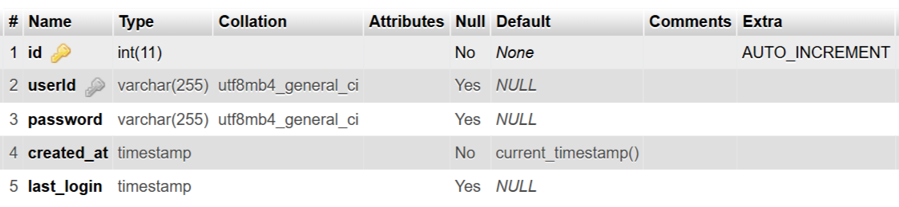
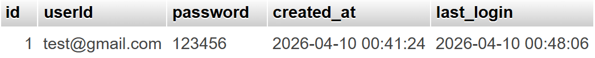

# SQL Concepts and Execution

This repository contains my understanding of SQL concepts along with example queries and their execution results.

---

## SQL Commands Used

### 1. CREATE TABLE

```sql
CREATE TABLE users_demo (
    id INT AUTO_INCREMENT PRIMARY KEY,
    userId VARCHAR(255) UNIQUE,
    password VARCHAR(255),
    created_at TIMESTAMP DEFAULT CURRENT_TIMESTAMP,
    last_login TIMESTAMP NULL
);
```

### Output



---

### 2. INSERT (Add User)

```sql
INSERT INTO users_demo (userId, password)
VALUES ('test@gmail.com', 'hashed_password');
```

### Output


---

### 3. SELECT (Fetch Data)

```sql
SELECT * FROM users_demo;
```

### Output


---

### 4. UPDATE (Last Login)

```sql
UPDATE users_demo
SET last_login = NOW()
WHERE userId = 'test@gmail.com';
```

### Output



---

### 5. INNER JOIN

```sql
SELECT u.userId, l.login_time
FROM users_demo u
INNER JOIN logins l
ON u.id = l.user_id;
```

### Output


---

### 6. GROUP BY

```sql
SELECT u.userId, COUNT(l.id) AS total_logins
FROM users_demo u
INNER JOIN logins l ON u.id = l.user_id
GROUP BY u.userId;
```

### Output


---

### 7. HAVING

```sql
SELECT u.userId, COUNT(l.id) AS total_logins
FROM users_demo u
INNER JOIN logins l ON u.id = l.user_id
GROUP BY u.userId
HAVING COUNT(l.id) > 1;
```

### Output


